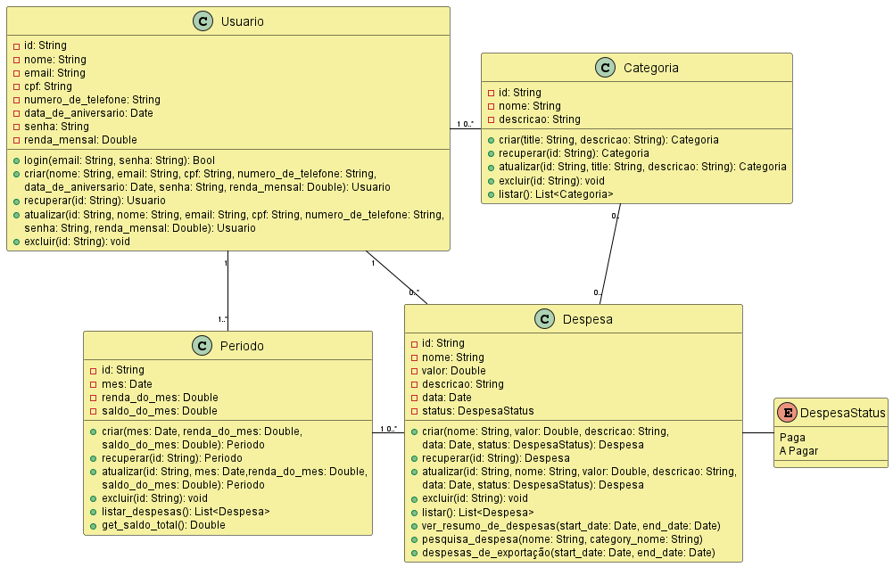
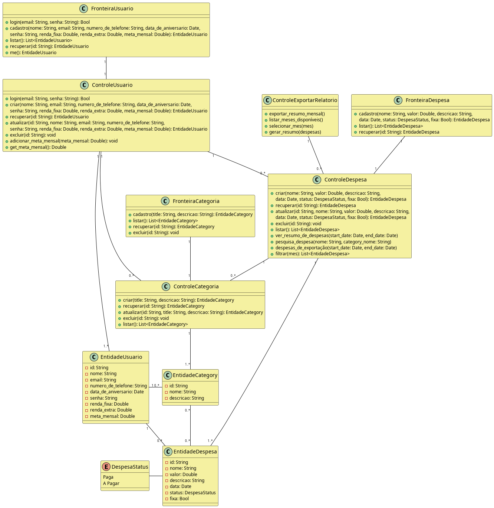

# Controle Financeiro Pessoal

## Descrição

Esta é uma aplicação de controle financeiro pessoal desenvolvida para ajudar os usuários a gerenciar suas despesas, receitas e metas de economia. A interface é limpa, intuitiva e utiliza componentes modernos para uma melhor experiência do usuário.

## Tecnologias Utilizadas

*   **Frontend:** Next.js, React, TypeScript
*   **Estilização:** Tailwind CSS, ShadCN UI
*   **Inteligência Artificial:** Google Genkit
*   **Armazenamento de Dados:** `localStorage` do navegador

## Modelagem do Sistema

O desenvolvimento desta aplicação foi guiado pelos seguintes diagramas, que foram fundamentais para a estruturação do código e das funcionalidades.

### Diagrama de Classes

### Diagrama de Classes BCE

---

> **Nota:** O desenvolvimento desta aplicação e a utilização dos diagramas de modelagem foram requisitos da disciplina de **ANÁLISE E PROJETO DE SISTEMAS ORIENTADOS A OBJETOS (APS)**.
